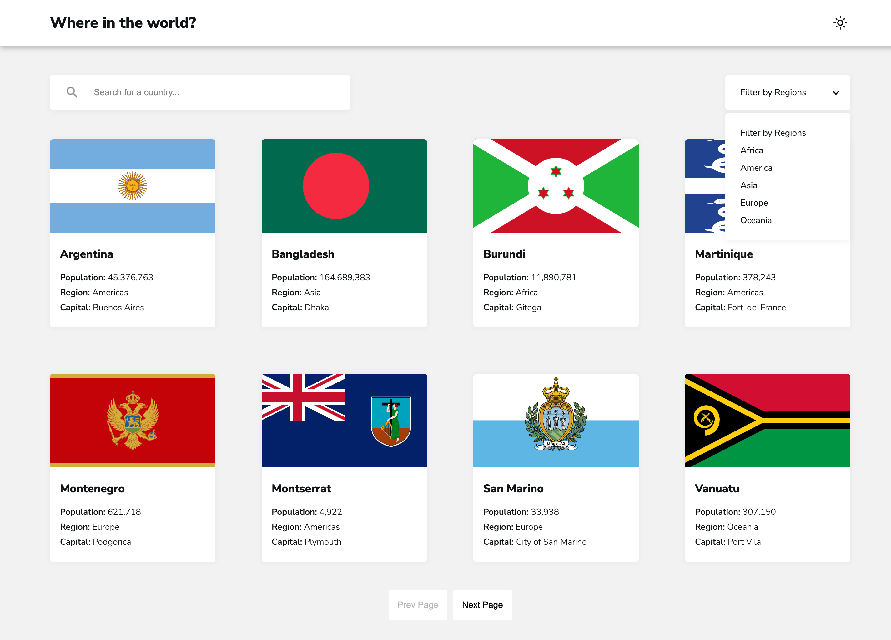

# Frontend Mentor - REST Countries API with color theme switcher solution

This is a solution to the [REST Countries API with color theme switcher challenge on Frontend Mentor](https://www.frontendmentor.io/challenges/rest-countries-api-with-color-theme-switcher-5cacc469fec04111f7b848ca). Frontend Mentor challenges help you improve your coding skills by building realistic projects. 

## Table of contents

- [Overview](#overview)
  - [The challenge](#the-challenge)
  - [Screenshot](#screenshot)
  - [Links](#links)
- [My process](#my-process)
  - [Built with](#built-with)
  - [What I learned](#what-i-learned)

**Note: Delete this note and update the table of contents based on what sections you keep.**

## Overview

### The challenge

Users should be able to:

- See all countries from the API on the homepage
- Search for a country using an `input` field
- Filter countries by region
- Click on a country to see more detailed information on a separate page
- Click through to the border countries on the detail page
- Toggle the color scheme between light and dark mode *(optional)*

### Screenshot

### Links

- Solution URL: [Add solution URL here](https://your-solution-url.com)
- Live Site URL: [Add live site URL here](https://your-live-site-url.com)

## My process

### Built with

- SASS
- Flexbox
- CSS Grid
- [React Vite](https://vitejs.dev/guide/) 
- [React Query](https://react-query-v3.tanstack.com/)
- [API Countries](https://restcountries.com/)

### What I learned

I'd love to share my experience working with React Query for the first time! It was definitely a fun and exciting experience, and I was amazed by how easy it made handling asynchronous data in my React applications.

One thing that stood out to me was how simple it was to handle cache with React Query. By default, React Query caches data in memory and automatically updates it when necessary. This means that if you make the same API call multiple times, React Query will only make the request once and then return the cached data for subsequent requests.

I was amazed by how easy it was to handle cache with React Query. It made my code much simpler and easier to understand, and it also made my app feel much faster and more responsive.

Overall, my experience working with React Query was really positive. It was fun and exciting to learn a new tool that made my work easier and more efficient, and I was amazed by how easy it was to handle cache. I'm looking forward to using React Query in future projects!

